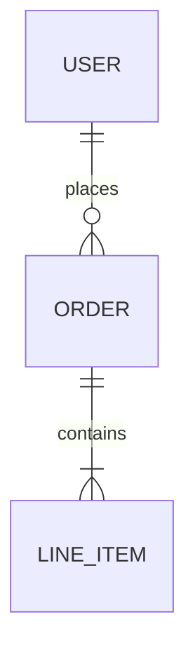

# Data Model <StatusBadge status="stub" />

The entities agents must respect when reading or writing data.

## Entities

| Entity | Purpose | Key fields |
|---|---|---|
| TBD | — | — |

## Invariants

Rules the data must always satisfy — the kind of thing an agent will violate unless told.

- TBD.

→ [Architecture Overview](/architecture/overview) · [API & Contracts](/architecture/api)
