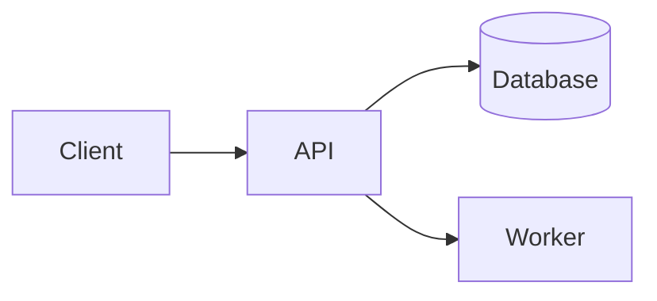

# Architecture Overview <StatusBadge status="stub" />

The system at a glance. Start with a component diagram, then drill into data model and flows.

## Components

- **TBD** — responsibility.

## Data model

Key entities and their relationships.

## Key flows

Describe the important request/data flows. Use a `sequenceDiagram` for anything ≥3 steps.

→ [Product Overview](/product/overview) · [Decisions](/decisions/0001-example-decision)
